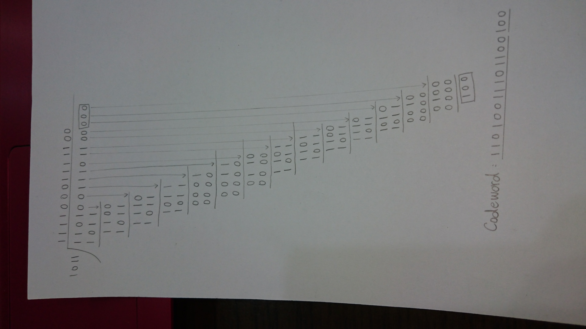
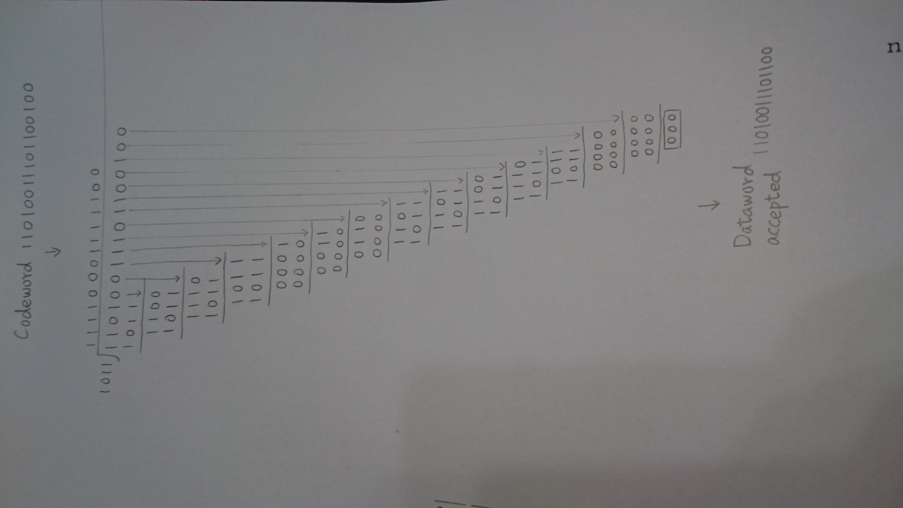
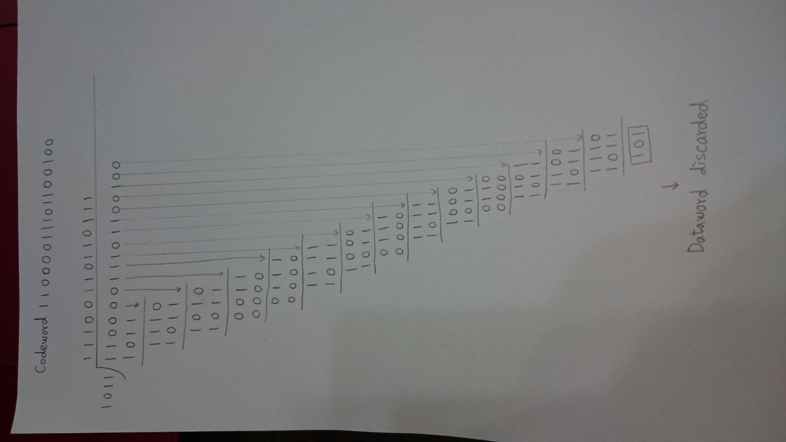

# Homework6-1
EX: 11101010

|Bit position|1|2|3|4|5|6|7|8|9|10|11|12|
|:----:|:----:|:----:|:----:|:----:|:----:|:----:|:----:|:----:|:----:|:----:|:----:|:----:|
|__Encoded data bit__|p1|p2|d1|p3|d2|d3|d4|p4|d5|d6|d7|d8|
||||||||||||||

### Encode
- step 1. 
  - Put data bits in position: 3, 5, 6, 7, 9, 10, 11, 12.

|Bit position|1|2|3|4|5|6|7|8|9|10|11|12|
|:----:|:----:|:----:|:----:|:----:|:----:|:----:|:----:|:----:|:----:|:----:|:----:|:----:|
|__Encoded data bit__|p1|p2|d1|p3|d2|d3|d4|p4|d5|d6|d7|d8|
||||1||1|1|0||1|0|1|0|

- step 2.
  - p1: bit position of (1, 3, 5, 7, 9, 11)
    - (p1, 1, 1, 0, 1, 1)
  - p1 = 0
  
|Bit position|1|2|3|4|5|6|7|8|9|10|11|12|
|:----:|:----:|:----:|:----:|:----:|:----:|:----:|:----:|:----:|:----:|:----:|:----:|:----:|
|__Encoded data bit__|p1|p2|d1|p3|d2|d3|d4|p4|d5|d6|d7|d8|
||0||1||1|1|0||1|0|1|0|

- step 3. 
  - p2: bit position of (2, 3, 6, 7, 10, 11)
    - (p2, 1, 1, 0, 0, 1)
  - p2 = 1
  
|Bit position|1|2|3|4|5|6|7|8|9|10|11|12|
|:----:|:----:|:----:|:----:|:----:|:----:|:----:|:----:|:----:|:----:|:----:|:----:|:----:|
|__Encoded data bit__|p1|p2|d1|p3|d2|d3|d4|p4|d5|d6|d7|d8|
||0|1|1||1|1|0||1|0|1|0|

- step 4. 
  - p3: bit position of (4, 5, 6, 7, 12)
    - (p3, 1, 1, 0, 0)
  - p3 = 0
  
|Bit position|1|2|3|4|5|6|7|8|9|10|11|12|
|:----:|:----:|:----:|:----:|:----:|:----:|:----:|:----:|:----:|:----:|:----:|:----:|:----:|
|__Encoded data bit__|p1|p2|d1|p3|d2|d3|d4|p4|d5|d6|d7|d8|
||0|1|1|0|1|1|0||1|0|1|0|

- step 5. 
  - p4: bit position of (8, 9, 10, 11, 12)
    - (p4, 1, 0, 1, 0)
  - p4 = 0
  
|Bit position|1|2|3|4|5|6|7|8|9|10|11|12|
|:----:|:----:|:----:|:----:|:----:|:----:|:----:|:----:|:----:|:----:|:----:|:----:|:----:|
|__Encoded data bit__|p1|p2|d1|p3|d2|d3|d4|p4|d5|d6|d7|d8|
||0|1|1|0|1|1|0|0|1|0|1|0|

Encoded data: 011011001010

### Decode

EX: bit position 9 is wrong __(1 -> 0)__

|Bit position|1|2|3|4|5|6|7|8|9|10|11|12|
|:----:|:----:|:----:|:----:|:----:|:----:|:----:|:----:|:----:|:----:|:----:|:----:|:----:|
|__Encoded data bit__|p1|p2|d1|p3|d2|d3|d4|p4|d5|d6|d7|d8|
||0|1|1|0|1|1|0|0|__0__|0|1|0|

- step 1, check with p1 (bit position 1):
  - bit position of (1, 3, 5, 7, 9, 11)
    - (0, 1, 1, 0, 0, 1)
  - Wrong.

- step 2, check with p2 (bit position 2):
  - bit bit position of (2, 3, 6, 7, 10, 11)
    - (1, 1, 1, 0, 0, 1)
  - Correct.

- step 3, check with p3 (bit position 4):
  - bit position of (4, 5, 6, 7, 12)
    - (0, 1, 1, 0, 0)
  - Correct.
 
- step 4, check with p4 (bit position 8):
  - bit position of (8, 9, 10, 11, 12)
    - (0, 0, 0, 1, 0)
  - Wrong.

- step 5, find wrong position: 1 (p1) and 8 (p4).
  - 1 + 8 = 9
  - error at bit posisiont 9 __(0 -> 1)__
  
# Homework6-2
- Encode 11010011101100 in CRC code, the divisor is 1011.

- CRC encoding

  - Codeword 11010011101100100

- CRC decoding 
  - Codeword 11010011101100100

  - Dataword accepted 11010011101100

- CRC detect error 
  - Codeword 110__0__0011101100100

  - Dataword discarded
